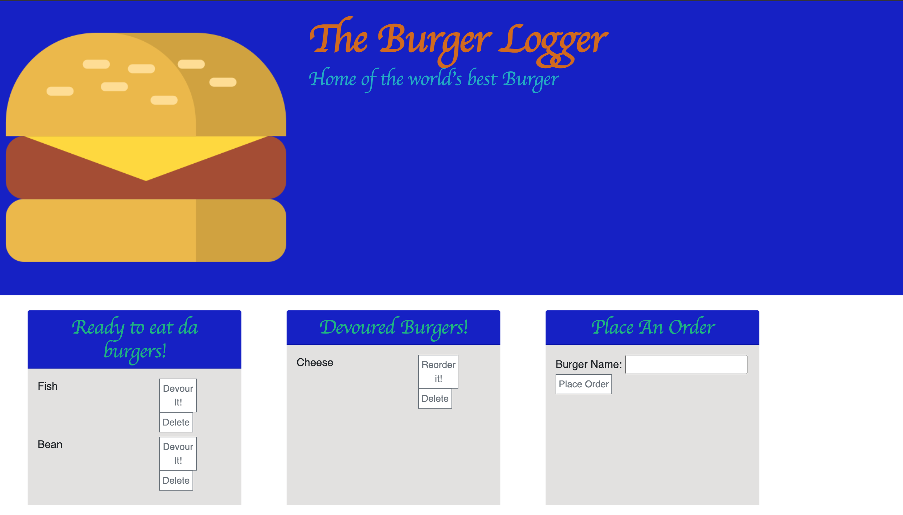

# # The-Burger-Log
by: Jack Funck


## table of Contents:
 - [Link.](#link)
 - [ Description. ](#desc)
 - [ Instructions. ](#instr)
 - [Technologies.](#tc)
 - [Dependencies](#dep)
 - [ Video. ](#video)
 - [Screen-Shots.](#sc)

<a name="link"></a>
## Link
give it a try: <a href="https://agile-waters-80427.herokuapp.com/" target="_blank">The-Burger-Logger</a>

<a name="desc"></a>
## Description
This is a restraunt app which let users input names of burgers that they like, devour the burgers, reorder the burger, or delete the burger.


<a name="instr"></a>
## Instructions
Either "Click" the heroku([Link.](#link)) above or

Run this command in your Command line
```
node server.js
```
* Type in localhost:8080/ in the browser and you will be brought to the home page.


<a name="tc"></a>
## Technologies Used
* Node.js
* JavaScript
* bootstrap
* handlebars
* Mysql workbench

<a name="dep"></a>
# Dependencies
* Mysql
* express
* express-handlebars
* orm



<a name="video"></a>
# Video of how it works.
> If you click GIF you will be navigated to YouTube for a full-video.

[](https://youtu.be/f-eAdCKbS6o)


<a name="sc"></a>
# Screen Shots
### Home

### Notes

